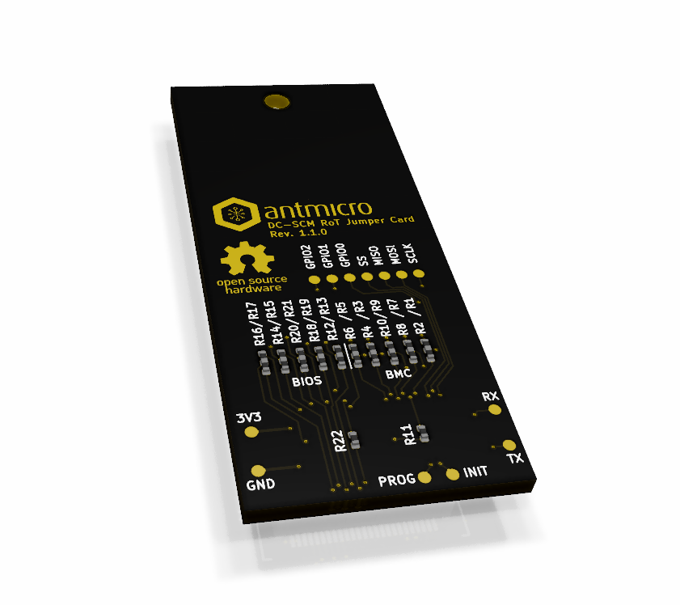

=======================
DC-SCM RoT Jumper Board
=======================

Copyright (c) 2020-2022 `Antmicro <https://www.antmicro.com>`_

Overview
========

This repository contains open hardware design files for a simple jumper board which connects QSPI memories to the configuration interface on Antmicro's `Experimental DC-SCM card <https://github.com/antmicro/artix-dc-scm>`_

Repository structure:
---------------------

The main repository directory contains the KiCad PCB project files, LICENSE and README.
The remaining files are stored in the following directories:

* ``img`` - contains graphics for this README
* ``lib`` - contains KiCad component libraries for the project
* ``doc`` - contains additional documentation generated from the project files

The design files were prepared in KiCad 5.1.9.

Key features
============

* Board-to-Board connector compatible with the DC-SCM card
* Jumper resistors for selecting the connection to one of the QSPI flash ICs located on the DC-SCM card

License
=======

`Apache-2.0 <LICENSE>`_
